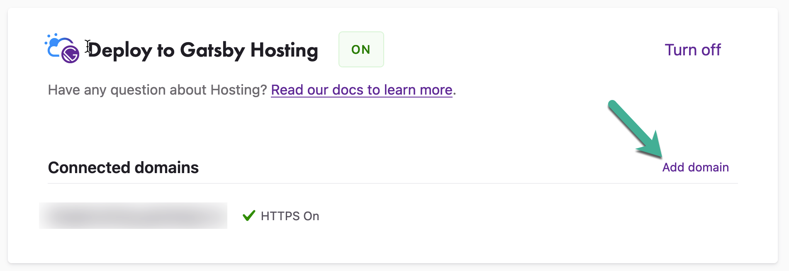
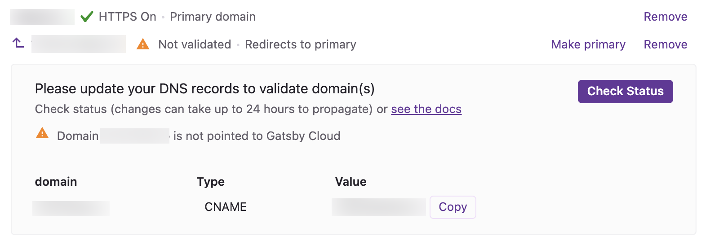
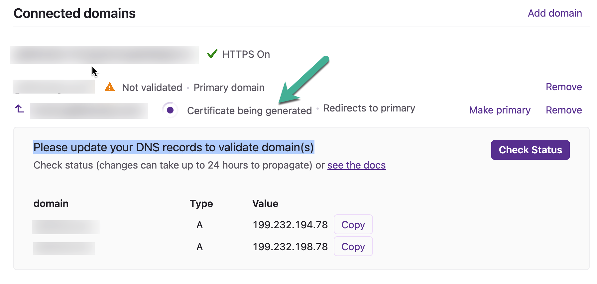
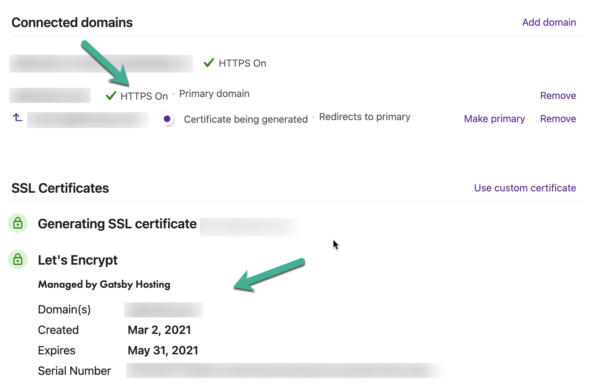
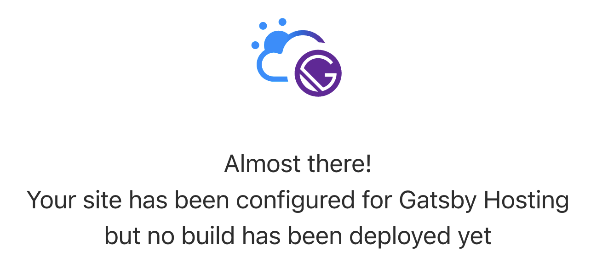
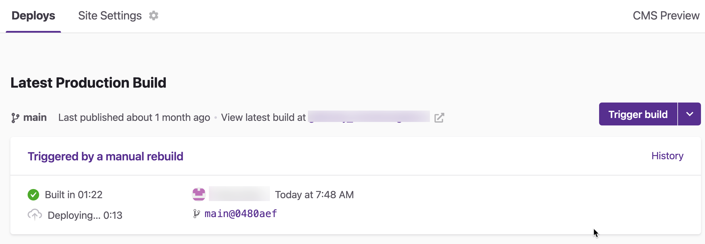

## Introduction

Gatsby Cloud allows you to specify Custom Domains for your Gatsby websites. This guide provides the steps for applying Custom Domains to your sites on Gatsby Cloud.

## Prerequisites

Before you can add a custom domain, you'll need to be hosting with Gatsby Cloud. If you haven't already, [turn on Gatsby Hosting](https://support.gatsbyjs.com/hc/en-us/articles/360061641114).

## Directions

### 1. Add a Domain

1. Go to Site Settings > Hosting.
1. Click **"Add Domain"** above the domain list to start the process  
   
1. In the **"Please enter a domain"** field, add one of the following:

- your apex or root domain (this is your custom domain without the www. part, e.g. mysite.com)
- your subdomain (e.g., www.mysite.com or store.mysite.com)  
  

Whichever one you choose will become the primary domain for your site.

#### Redirect to the Primary Domain

If you add an apex domain, Gatsby Hosting will automatically add a redirect that points the www. subdomain to the apex domain. Similarly, if you add a www. subdomain, Gatsby Hosting will automatically add a redirect that points the apex domain to it. Read more about redirected domains in [Working with Redirected Domains](https://support.gatsbyjs.com/hc/en-us/articles/1500003051241).

### 2. Configure Your Domain Name System (DNS)

Next you'll need to visit your 3rd party DNS registrar (e.g. GoDaddy, NameCheap, etc.) to add some DNS records. A DNS Record is an entry in a DNS with details about how to route a request for a given domain name.

#### Apex Domain Configuration

If you added an apex domain, you will need to add an Address Mapping Record (A Record).

1. Copy one of the IP addresses from the "Value" column for the A records shown next to your custom domain.
1. In your DNS provider's domain settings, create an A Record for the IP address you chose.  
   

The A Record must point to one of the IP addresses shown for your site. It is only necessary to create an A Record for one of the IP addresses listed.

#### Subdomain Configuration

If you added a subdomain, you will need to add a Canonical Name Record (CNAME). The CNAME record must point to the default domain for your site.  

#### How to Add DNS Records for Popular Registrars

Here's documentation on adding DNS records for some popular name registrars:

- Go Daddy: [A Record](https://www.godaddy.com/help/add-an-a-record-19238) | [CNAME](https://www.godaddy.com/help/add-a-cname-record-19236)
- Name.com: [A Record](https://www.namecheap.com/support/knowledgebase/article.aspx/319/2237/how-can-i-set-up-an-a-address-record-for-my-domain/) | [CNAME](https://www.namecheap.com/support/knowledgebase/article.aspx/9646/2237/how-to-create-a-cname-record-for-your-domain/)
- NameCheap: [A Record](https://www.name.com/support/articles/115004893508-Adding-an-A-record) | [CNAME](https://www.name.com/support/articles/115004895548-Adding-a-CNAME-Record)
- Google Domains: [A Record](https://support.google.com/a/answer/2579934?hl=en&ref_topic=2721296) | [CNAME](https://support.google.com/a/answer/47283)

## 3. Check DNS Status

Once you've added your DNS record, click **"Check Status"** or refresh the page to check that your DNS record has been recognized by Gatsby Hosting.  

If your domain fails to validate after 24 hours, try creating an A Record for one of the other IP addresses available instead.  

## 4. Generate SSL Certificate

After the domain is validated, we'll generate a free SSL certificate via Let's Encrypt and automatically configure it. This whole process can take a few minutes to complete.  

**Note**: DNS records need to be fully propagated in order to properly verify the certificates. If not, SSL certification generation will fail.

## 5. Finish

Once your custom domain has the **"HTTPS On"** label next to it, you should be able to visit it to see your site live.  

If you encounter errors related to the the connection not being secure, please allow a few minutes as it can take time for DNS changes to take effect and be detected by all browsers. Use this time to verify that you followed the above steps completely.

## Other Considerations

If you see the following when you visit your custom domain, the site may still be building.  

Check the **"Deploys"** tab for your site to see the current status of your builds.  

