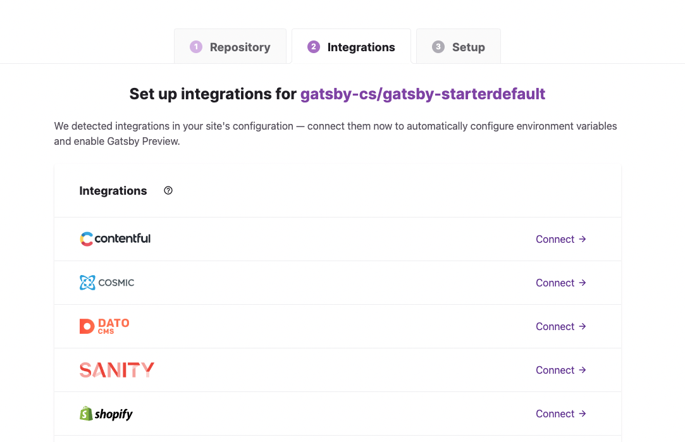

## Introduction

This guide covers how to create a Gatsby Cloud site by cloning a Gatsby starter. Note, cloning of starters is only supported for Github. If you use GitLab or BitBucket, you'll have to follow the [Create a Site from a Repository](/docs/how-to/cloud/create-site-from-repository/) guide instead.

## Directions

### 1. Choose your starter template

From your Gatsby Cloud dashboard, click the **Add a Site** button.

On the right hand side, click on the card labeled "Gatsby Default Starter".

### 2. Configure your repository

The first time you set up a Gatsby Cloud site, you will need to connect your Gatsby account to Github by clicking on the "Github" icon in the Create a Git repository card.

Next, a pop up window should appear and prompt you to install the Gatsby Cloud app to your Github personal account. Click **Install**.

After the Github app is installed, you will return to Gatsby Cloud. Here you can select a different Github organization to host the repository under as well as change the name of the repository that will be created if you prefer. Then click **Next** to create the site.

### 3. Connect integrations

Next, you'll be prompted to connect any integrations. Here is where you can connect your Gatsby Cloud site to your CMS instance. For the purposes of this tutorial, you can select **Skip this step**.

### 4. Set-up summary

After the repository is created, you'll be given the option to configure any necessary environment variables. This step allows you to add both build and preview variables to your site.

Next, click **Create Site** and you will be taken to the main tab of the Site Overview page for your new site.

### 5. Finish

Once your site is done building, you can view the site in two places:

#### Private build URL

Use the build URL to preview the deployed site. This URL is not indexed and is only accessible via direct link.

#### Public default domain

Use your Gatsby Hosting provided "default domain" to access the public deployment of your site. Gatsby Hosting is turned on by default and the default domain is listed under Site Settings > Hosting.

