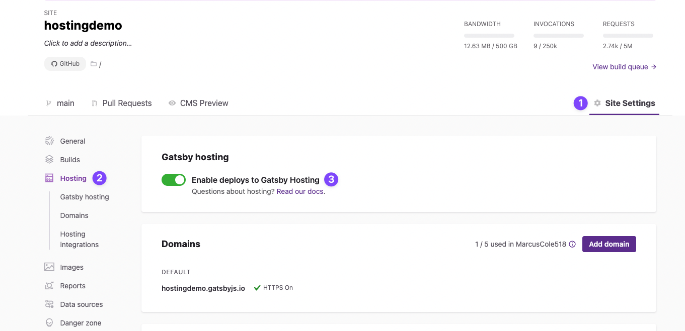
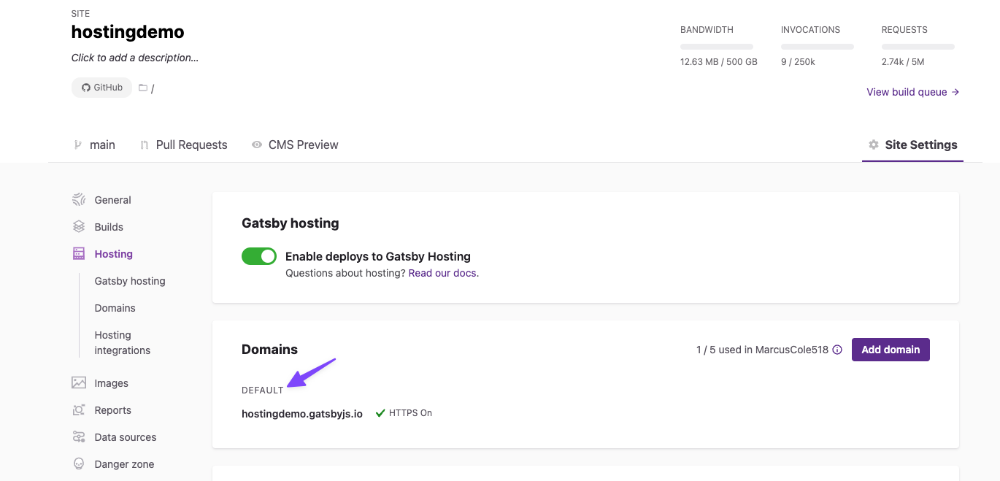

In this guide, you'll learn how to deploy your site to Gatsby Cloud Hosting.

## Prerequisites

This tutorial assumes you have already set up a Gatsby Cloud site.

## Enable Gatsby Hosting

In the Gatsby Cloud Site Hosting Settings, select **Enable Deploys to Gatsby Cloud Hosting**.

This will trigger a new Production Build for your site. When that Production Build completes, your site will be ready to view.

### Default Domain

You will receive a default domain for your site base: `YOUR_SITE_PREFIX.gatsbyjs.io`. This domain has `HTTPS` on by default. Visit the `https://<default domain>` URL to see your hosted site.

### First Deploy
Before your first Production Build after turning on Gatsby Hosting completes, you will see the following when you visit your default domain.

### Changing Your Default Domain
You can update your default domain by changing the Site Prefix of your Gatsby site in the General tab of Site Settings.

### Other Resources
- See [Adding a Custom Domain](./adding-a-custom-domain.md) for adding a custom domain to your Gatsby Cloud site.