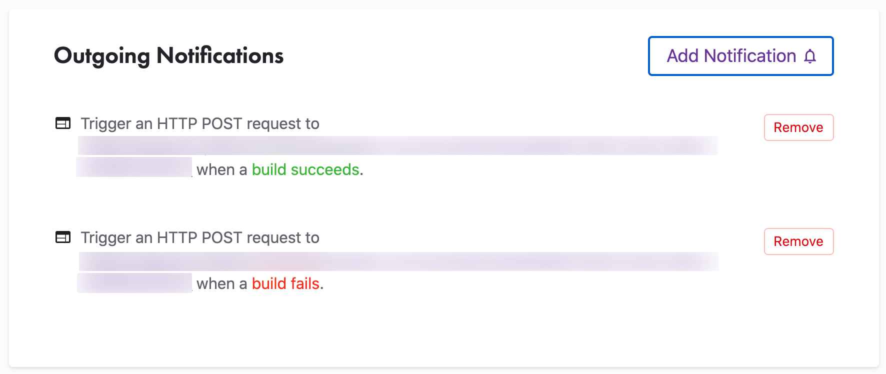
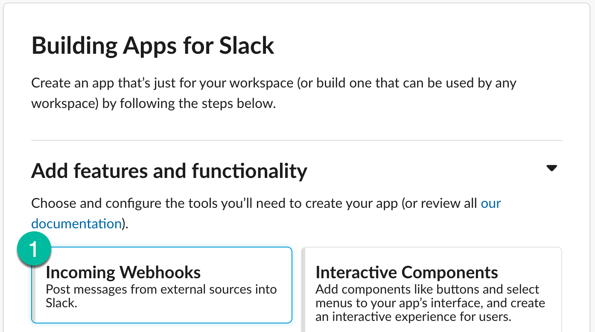

When your Gatsby site is built and deployed on Gatsby Cloud, you now have the option to hook up a set of outgoing notifications regarding the status of that build. You can send notifications via:

1. A generic webhook.
1. A webhook that sends a Slack message.
1. Pull Request comments in Github or GitLab.

By default, the Pull Request comments are already set up for existing and new sites in Gatsby Cloud.

### Adding webhook notifications

1. First, navigate to Site Settings. In the sidebar menu under "General", select **"Outgoing Notifications"**. Then click **"Add Notification"** and choose the "Webhooks" option.


2. Next, you will be prompted to add a webhook that will receive the payload of information about your build or deploy. There are the following options for event notifications:

- build succeeded
- build failed
- build timed out
- preview succeeded
- preview failed
- preview timed out
- deploy succeeded
- deploy failed

3. Paste your webhook into the "Outgoing webhook URL" field, choose an event to listen to, then click **Save**. If you want to trigger notifications for multiple events, add a new notification for each.



#### Webhook message payload

You can expect the message payload to appear as following:

```json
{
  "body": "Markdown message similar to PR comment",
  "buildId": "string-id-of-your-build",
  "workspaceName": "your-workspace-name",
  "siteName": "your-project-name",
  "deployPreviewUrl": "https://your-project.staging-previews.gtsb.io",
  "logsUrl": "https://staging.gtsb.io/dashboard/{workspace-id}/sites/{site-id}/builds/{build-id}/details",
  "duration": "time-of-build",
  "resourceId": "UUID of resource",
  "resourceType": "SITE",
  "event": "BUILD_SUCCEEDED"
}
```

### Adding slack notifications

To take advantage of Slack notifications, you first need to create a custom Slack application to handle the webhook message.

1. First, [add a new Slack app](https://api.slack.com/apps?new_app=1). Add one for a workspace where you have [appropriate permissions](https://slack.com/help/articles/201314026-Permissions-by-role-in-Slack#apps-integrations).


2. Next, add the "Incoming Webhook" feature and activate it. Then, at the bottom of that page, click **"Add New Webhook to Workspace"**:



3. Now, select an appropriate channel for your notifications and click **"Allow":**


After that, you will see a success message and a new webhook URL will be generated. Copy the "Webhook URL".


4. Finally, return to Gatsby Cloud and navigate to the "Outgoing notifications" settings. Click **"Add Notification"** and choose the "Slack" option. Paste the Slack application's webhook URL that you previously copied into the "Outgoing webhook URL" field.

5. Choose which Event to listen to and then click **"Save"**. You can reuse the same Slack application webhook for all four event types. If you want to send a notification to multiple channels, you must generate additional Webhook URLs for your Slack app and create additional notifications as described above.
