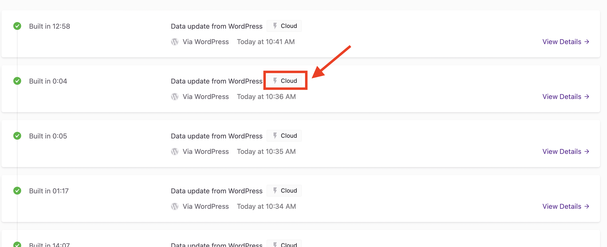

If your site uses a content management system (CMS), Gatsby Cloud provides a tool to quickly preview content changes and collaborate with content editors. When you add a site to Gatsby Cloud, you will find CMS Previews under the "CMS Preview" tab of the Site Overview.

A "CMS Preview" is a development build of your site that enables you to make changes in your CMS and see those changes take effect in real-time.

Using CMS Previews requires connecting your site to [one of the supported CMSs](/docs/reference/cloud/hosting-and-data-source-integrations). Check out the [Connecting to a Content Management System](https://support.gatsbyjs.com/hc/en-us/sections/360011112314-Connecting-to-a-Content-Management-System) tutorials for more information on how to configure your site for CMS Previews.

## How CMS Previews are triggered

A CMS Preview build may be triggered when any of the following events occur:

- A change in the connected CMS (such as an autosave while typing, save, or publish action).
- A Git commit to the production branch configured in "Site Settings."
- Manually clicking the "Trigger Build" or "Restart Preview" button in the Gatsby Cloud user interface.
- A `POST` request to the Preview Webhook.

## How CMS Previews are built

There are two CMS Preview build approaches; these are the "legacy" preview experience and the new "incremental preview" build.

### Incremental Preview

This is the default preview builder. It is a production build of your site using preview data as specified by your environment variables. The main benefits are:

- Fast updates after initial build.
- All successful preview builds are always available.
- Support for the [preview status indicator](/docs/reference/release-notes/v3.6/#preview-status-indicator) on Gatsby v3 and later.

All other [CMSs integrations for Gatsby Cloud](https://support.gatsbyjs.com/hc/en-us/sections/360011112314-Connecting-to-a-Content-Management-System) support incremental previews. Of these, the following require a specific source plugin version:

- WordPress: `gatsby-source-wordpress ≥ 5.2.3`
- DatoCMS: `gatsby-source-datocms ≥ 2.6.15`
- Sanity: `gatsby-source-sanity ≥ 7.3.2`

Incremental Previews are those noted with the "CLOUD" badge:

### Legacy Preview

This preview builder is only used where incremental previews are not possible. The build process is similar to `gatsby develop` in local development. It is subject to resource timeouts and the preview will not be available until the next build completes after a timeout occurs.

## Preview extensions

Some CMSs support a preview extension that enables you to view your CMS Preview build without having to leave your CMS. Preview extensions are available for:

- Contentful
- Cosmic
- DatoCMS
- WordPress
- Sanity

Check out the [Preview Extensions](https://support.gatsbyjs.com/hc/en-us/sections/360012244833) tutorials for more information. WordPress preview loader doesn't support password-protected preview instances.

## Disabling Preview

You can disable Preview by visiting "Site Settings > Preview" and unchecking **"Enable CMS Preview builds"**.

If your preview fails to build for 10 consecutive builds, Gatsby Cloud will automatically disable the Preview.
