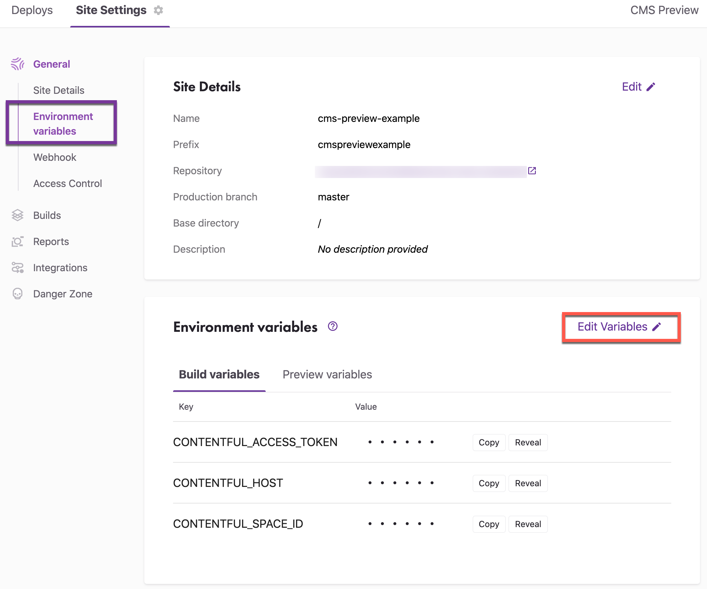
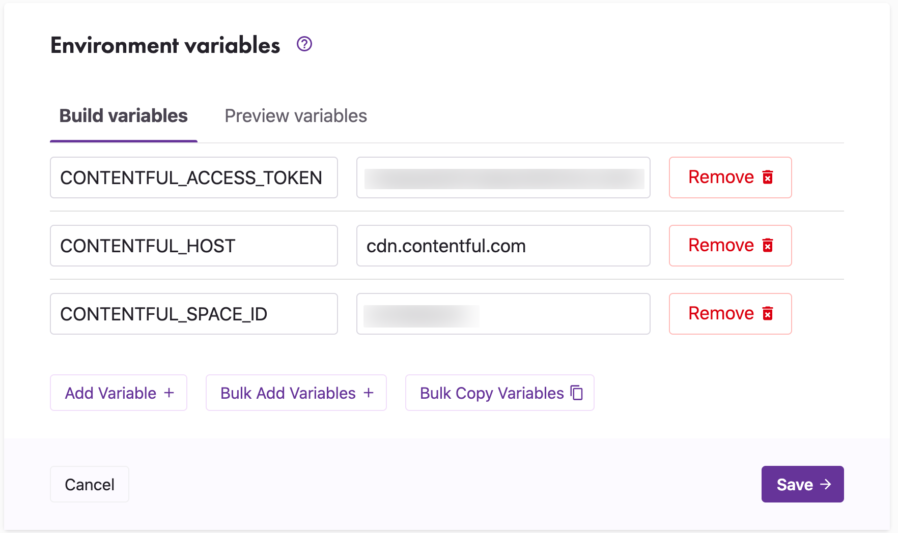
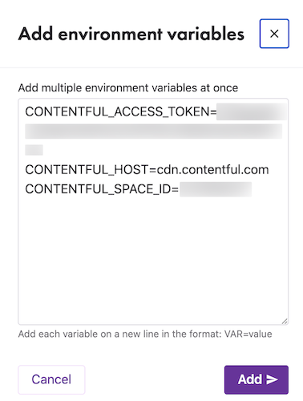

Environment variables allow you to provide environment specific configurations for your Gatsby site. A typical use case for environment variables is to provide secret API tokens to your application without having to hard code values in your source code.

When working with Gatsby Cloud you will have two environments you can configure for:

1. Production Builds and Pull Request Builds
1. CMS Previews

This guide covers how to set environment variables and assumes you already have your site created.

## Setting Environment Variables
Environment variables can be accessed via the dashboard menu by clicking **Site Settings > General > Environment Variables**.



Click the **Edit Variables** icon to add or update variables. The first field is the variable **name** and the second field is the **value**.

- **Build variables** apply to Production Builds and Pull Request Builds
- **Preview variables** apply to CMS Previews


When you are done editing both your Builds and Preview variables, click **Save** to confirm changes.

**Note**: Editing environment variables will trigger a new build of your site.


### Bulk Copy/Add Variables
As a convenience, you can copy/add environment variables in bulk. Copy all variables for the Build or Preview environment by clicking Edit Variables and then the Bulk Copy Variables button.

To add variables in bulk, click the Bulk Add Variables button. Use the format name=value and enter each variable on a new line. 



Variables added in bulk do not overwrite existing variables, they are appended to the current list. However, you can delete the old variables after you have added the new ones.

 

Accessing Environment Variables
The environment variables you set can be accessed in source code by referencing `process.env.<variable name>`. For example:

```javascript
const contentfulConfig = {
  spaceId: process.env.CONTENTFUL_SPACE_ID,
  accessToken: process.env.CONTENTFUL_ACCESS_TOKEN, 
};

if (process.env.CONTENTFUL_HOST) {
  contentfulConfig.host = process.env.CONTENTFUL_HOST;
}
```